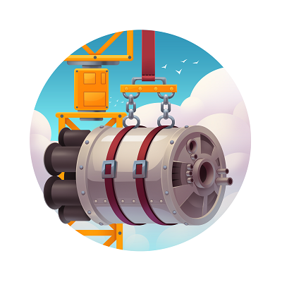

# Challenge 2: Deploying databases on Azure using Terrform CLI

**Watch** our [introduction video](https://aka.ms/tfonazure/vid/day2) to learn all about this #TerraformOnAzure coding challenge!

## Description

In this second challenge, you will continue where we left off in the previous challenge and you will host the application databases on Azure. You will have to provision all requireed Azure resources using [HashiCorp's Terraform](https://www.terraform.io/).

The [sample application](https://github.com/Terraform-On-Azure-Workshop/AzureEats-Website) has **2 databases**: the products database and the shopping cart database. You will deploy the products database on [**Azure SQL Database**](https://docs.microsoft.com/en-us/azure/azure-sql/database/sql-database-paas-overview?ocid=aid3015373_ThankYou_DevComm&eventId=HashiConfTerraformonAzure_JK1-K2-hoArJ), a fully managed Platform-as-a-Service database engine. 

The shopping cart database is a **MongoDB database**, which you will deploy in a container on [**Azure Container Instances**](https://docs.microsoft.com/en-us/azure/container-instances/container-instances-overview?ocid=aid3015373_ThankYou_DevComm&eventId=HashiConfTerraformonAzure_JK1-K2-hoArJ) (ACI).

> 🔔 **IMPORTANT:** Make sure to pull the latest updates from the [sample application](https://github.com/Terraform-On-Azure-Workshop/AzureEats-Website) to get the latest changes! 🔔

## Success criteria 🏆

To successfully complete this challenge, you will have to:

* Use the Terraform CLI to provision the Azure resources to host 1) an Azure SQL database, 2) a MongoDB database on Azure Container Instances.
* Use the Azure CLI to deploy the sample application from a GitHub repo, using Azure App Service Deployment Center Continuous Deployment (not using GitHub Actions at this time!).
* Connect the sample application in Azure App Service to both databases, by configuring the App Settings through Terraform configuration.

Spoiler: the [solution](./Solution.md) to this coding challenge is now available.

## How to submit your solution?

Within 24 hours of making the coding challenge public, submit your solution as a custom ISSUE to this GitHub repository.

 1. Create your own Github repo with your solution for that challenge.
 2. Create a new [Challenge Solution Submission issue](https://github.com/Terraform-On-Azure-Workshop/terraform-azure-hashiconf2020/issues/new/choose) in our repo for each challenge and fill all the details.
 3. Submit the issue.

## Prerequisites

- An Azure subscription, where you have permissions to create resource groups. You can get an [Azure free account](https://azure.microsoft.com/en-us/free/) or send us a DM us [on Twitter](https://twitter.com/msdev_nl) and we'll provide you with an Azure Pass.
- A [GitHub account](https://github.com/), allowing you to create a custom issue to submit your solution. 
- Fork the [sample application](https://github.com/Terraform-On-Azure-Workshop/AzureEats-Website) to your GitHub account.

## How to get started with Terraform on Azure

There are different ways to get started with Terraform. The easiest is to use the [Azure Cloud shell](https://docs.microsoft.com/en-us/azure/developer/terraform/getting-started-cloud-shell?ocid=aid3015373_ThankYou_DevComm&eventId=HashiConfTerraformonAzure_JK1-K2-hoArJ). Alternatively, you can [install Terraform](https://learn.hashicorp.com/terraform/getting-started/install#install-terraform) on your local machine.

## Running the application in frontend mode

To connect to the application databases, you will need to configure both database connection strings in the [application settings](https://docs.microsoft.com/en-us/azure/app-service/configure-common?ocid=aid3015373_ThankYou_DevComm&eventId=HashiConfTerraformonAzure_JK1-K2-hoArJ). These need to specified on the Azure App Service.

| Setting | Value |
| :------ | :---- |
| WEBSITE_NODE_DEFAULT_VERSION | 10.15.2 |
| ApiUrl                       | /api/v1 |
| ApiUrlShoppingCart           | /api/v1 |
| **MongoConnectionString**    | <your MongoDB connection string> |
| **SqlConnectionString**      | <your Azure SQL connection string> |
| productImagesUrl             | https://raw.githubusercontent.com/suuus/TailwindTraders-Backend/master/Deploy/tailwindtraders-images/product-detail |
| Personalizer__ApiKey         |  |
| Personalizer__Endpoint       |  |

## Resources/Tools Used 🚀

A simple App Service and Terraform script should do it for this challenge. Here's a [tutorial](https://docs.microsoft.com/en-us/azure/developer/terraform/provision-infrastructure-using-azure-deployment-slots
) on how to get started.

* [Azure Cloud Shell](https://shell.azure.com?ocid=aid3015373_ThankYou_DevComm&eventId=HashiConfTerraformonAzure_JK1-K2-hoArJ)
* [Visual Studio Code](https://code.visualstudio.com?ocid=aid3015373_ThankYou_DevComm&eventId=HashiConfTerraformonAzure_JK1-K2-hoArJ)
* [Terraform](https://www.terraform.io/)

## More Resources

* ✅ [Terraform AzureRM Azure SQL provider documentation](https://www.terraform.io/docs/providers/azurerm/r/sql_database.html)
* ✅ [Azure App Service documentation](https://docs.microsoft.com/en-us/azure/app-service/app-service-web-get-started-dotnet?ocid=aid3015373_ThankYou_DevComm&eventId=HashiConfTerraformonAzure_JK1-K2-hoArJ)
* ✅ [Azure SQL Database documentation](https://docs.microsoft.com/en-us/azure/azure-sql/database/sql-database-paas-overview?ocid=aid3015373_ThankYou_DevComm&eventId=HashiConfTerraformonAzure_JK1-K2-hoArJ)
* ✅ [Azure Container Instances documentation](https://docs.microsoft.com/en-us/azure/container-instances/container-instances-overview?ocid=aid3015373_ThankYou_DevComm&eventId=HashiConfTerraformonAzure_JK1-K2-hoArJ)
* ✅ [Hosting MongoDB on Azure Container Instances](https://jussiroine.com/2019/02/an-adventure-in-containers-and-command-line-tools-running-mongodb-in-azure/)

## Questions? Comments? 🙋‍♀️

If you have any questions about the challenges, feel free to open an **[ISSUE HERE](https://github.com/Terraform-On-Azure-Workshop/terraform-azure-hashiconf2020/issues)**.

Make sure to mention which challenge is problematic. We'll get back to you soon!

## I don't have an Azure subscription! 🆘

If you don't have an Azure subscription yet, you can DM us [on Twitter](https://twitter.com/msdev_nl) and we'll provide you with a 30-day Azure subscription! Alternatively, you can also [sign up](https://azure.microsoft.com/en-us/free/?ocid=aid3015373_ThankYou_DevComm&eventId=HashiConfTerraformonAzure_JK1-K2-hoArJ) for an Azure free account.
