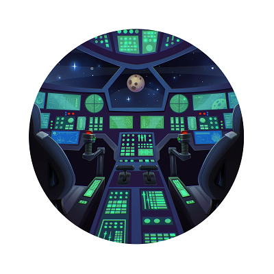

# Challenge 3: Remote state and CI/CD with GitHub Actions

**Watch** our [introduction video](https://aka.ms/tfonazure/vid/day3) to learn all about this #TerraformOnAzure coding challenge!

## Description

So far, you have been working on your local developer machine to provision and deploy the application. In this third challenge, you will setup a **Continuous Integration/Continuous Deployment (CI/CD) pipeline using [GitHub Actions](https://help.github.com/en/actions)**.

However, when running Terraform locally it also stores the current state of the infrastructure in a local file. When running a CI/CD pipeline, or when working in a team, you need to share the current state of the infrastructure. Terraform allows you to define remote state in a central location. In this challenge, you will configure the Terraform CLI to **[store the remote state in Azure Storage](https://docs.microsoft.com/en-us/azure/developer/terraform/store-state-in-azure-storage)**.

Also, keep in mind that when you run Terraform locally, you typically authenticate interactively as a user to the Azure CLI. In a CI/CD pipeline, there is no interactive user session, so you will need to **[authenticate to Azure using a Service Principal](https://www.terraform.io/docs/providers/azurerm/guides/service_principal_client_secret.html)**.

## Success criteria 🏆

To successfully complete this challenge, you will need to:

* Create an Azure Storage account to store the Terraform remote state
* Use the Terraform CLI to configure the remote state to use the remote state on Azure Storage
* Setup a Service Principal in Azure to allow non-interactive authentication
* Setup a CI/CD workflow in GitHub Actions that:
    * runs the Terraform CLI to provision the Azure infrastructure resources,
    * runs the Azure CLI to deploy the sample application to Azure App Service

## How to submit your solution?

Within 24 hours of making the coding challenge public, submit your solution as a custom ISSUE to this GitHub repository.

 1. Create your own Github repo with your solution for that challenge.
 2. Create a new [Challenge Solution Submission issue](https://github.com/Terraform-On-Azure-Workshop/terraform-azure-hashiconf2020/issues/new/choose) in our repo for each challenge and fill all the details.
 3. Submit the issue.

## Prerequisites

- An Azure subscription, where you have permissions to create resource groups. You can get an [Azure free account](https://azure.microsoft.com/en-us/free/) or send us a DM us [on Twitter](https://twitter.com/msdev_nl) and we'll provide you with an Azure Pass.
- A [GitHub account](https://github.com/), allowing you to create a custom issue to submit your solution. 
- Fork the [sample application](https://github.com/Terraform-On-Azure-Workshop/AzureEats-Website) to your GitHub account.

## Resources/Tools Used 🚀

* [Azure Cloud Shell](https://shell.azure.com)
* [Visual Studio Code](https://code.visualstudio.com)
* [Terraform](https://www.terraform.io/)

## More Resources

* ✅ [Terraform GitHub Actions documentation](https://www.terraform.io/docs/github-actions/setup-terraform.html)
* ✅ [Authenticating using a Service Principal](https://www.terraform.io/docs/providers/azurerm/guides/service_principal_client_secret.html)
* ✅ [GitHub Actions documentation](https://help.github.com/en/actions)
* ✅ [Store state in Azure Storage](https://docs.microsoft.com/en-us/azure/developer/terraform/store-state-in-azure-storage)

## Questions? Comments? 🙋‍♀️

If you have any questions about the challenges, feel free to open an **[ISSUE HERE](https://github.com/Terraform-On-Azure-Workshop/terraform-azure-hashiconf2020/issues)**.

Make sure to mention which challenge is problematic. We'll get back to you soon!

## I don't have an Azure subscription! 🆘

If you don't have an Azure subscription yet, you can DM us [on Twitter](https://twitter.com/msdev_nl) and we'll provide you with a 30-day Azure subscription! Alternatively, you can also [sign up](https://azure.microsoft.com/en-us/free/) for an Azure free account.
