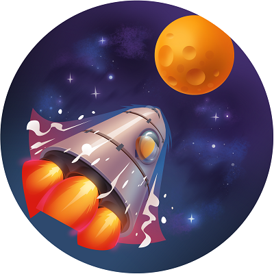

# Challenge 5: connecting it all with Consul



**Watch** our [introduction video](https://aka.ms/tfonazure/vid/day5) to learn all about this #TerraformOnAzure coding challenge!

## Description

With our applications now running on Azure Kubernetes Service (AKS), we want make sure that they can communicate with each other, while still staying secure.
In this final challenge, you will set up [Consul](https://www.consul.io) on your previously created AKS cluster using [Terraform](https://www.terraform.io).
This will allow us to have mTLS encryption between all our services, and manage which services can communicate with each other.

You will then be able to create a Service Mesh that [spans](https://www.consul.io/docs/connect/mesh-gateway) all of the AKS clusters of everyone participating.

## Success criteria 🏆

To successfully complete this challenge, you will need to [deploy](https://www.consul.io/docs/k8s/installation/overview) a **single node Consul cluster** on your AKS cluster using the [Helm provider](https://www.terraform.io/docs/providers/helm/r/release.html) for Terraform.
The datacenter of the Consul cluster configuration must be named after your GitHub username.

The Consul cluster **must be federated with the primary datacenter**.
To [federate](https://www.consul.io/docs/connect/wan-federation-via-mesh-gateways) the Consul clusters, you need to create a Kubernetes secret, containing all the needed configuration to federate Consul, from the `assets/consul-federation-secret.yaml` file that is provided with the challenge.

In order for the Mesh Gateways to reach each other, they need to be **exposed on a public IP**.
This can be done by [creating a static IP](https://www.terraform.io/docs/providers/azurerm/r/public_ip.html) and a [Kubernetes service](https://docs.microsoft.com/en-us/azure/aks/static-ip#create-a-service-using-the-static-ip-address) with [Terraform](https://www.terraform.io/docs/providers/kubernetes/r/service.html) that points at the selectors `app=consul` and `component=mesh-gateway`.

To check if your cluster has successfully joined the other clusters, you can run `consul members -wan` inside the consul-server-0 pod of your AKS cluster.
You should see a similar output as below, including `consul-server-0.<your datacenter>` and anyone else that has federated their cluster for this challenge.

```shell
/ # consul members -wan
Node                  Address           Status  Type    Build       Protocol  DC     Segment
consul-server-0.dc1   10.244.0.12:8302  alive   server  1.8.0beta2  2         dc1    <all>
consul-server-0.eveld 10.244.0.15:8302  alive   server  1.8.0beta2  2         eveld  <all>
```

For extra credit you can enable catalog [syncing](https://www.consul.io/docs/k8s/service-sync) between Kubernetes and Consul.
You should then see any Kubernetes services automatically sync into the Consul service catalog, e.g.

```shell
/ # consul catalog services
consul
mesh-gateway
```

## How to submit your solution

Within 24 hours of making the coding challenge public, submit your solution as a custom ISSUE to this GitHub repository.

 1. Create your own Github repo containing your solution for that challenge.
 2. Create a [Challenge Solution Submission ISSUE](https://github.com/Terraform-On-Azure-Workshop/terraform-azure-hashiconf2020/issues/new/choose) in our repo and fill all the details.
 3. Submit the issue.

## Prerequisites

- Completed [challenge #4](https://github.com/Terraform-On-Azure-Workshop/terraform-azure-hashiconf2020/tree/main/challenges/challenge4), where you set up an AKS cluster and deployed the applications.

## Resources/Tools Used 🚀

- [Azure Cloud Shell](https://shell.azure.com)
- [Visual Studio Code](https://code.visualstudio.com)
- [Terraform](https://www.terraform.io/)
- [Consul](https://www.consul.io)
- [Kubectl](https://kubernetes.io/docs/tasks/tools/install-kubectl/)

## More Resources

- ✅ [Terraform Azure provider](https://www.terraform.io/docs/github-actions/setup-terraform.html)
- ✅ [Authenticating using a Service Principal](https://www.terraform.io/docs/providers/azurerm/guides/service_principal_client_secret.html)
- ✅ [Consul WAN federation via Mesh Gateways](https://www.consul.io/docs/connect/wan-federation-via-mesh-gateways)

## Questions? Comments? 🙋‍♀️

If you have any questions about the challenges, feel free to open an **[ISSUE HERE](https://github.com/Terraform-On-Azure-Workshop/terraform-azure-hashiconf2020/issues)**.

Make sure to mention which challenge is problematic. We'll get back to you soon!

## I don't have an Azure subscription! 🆘

If you don't have an Azure subscription yet, you can DM us [on Twitter](https://twitter.com/msdev_nl) and we'll provide you with a 30-day Azure subscription! Alternatively, you can also [sign up](https://azure.microsoft.com/en-us/free/) for an Azure free account.
